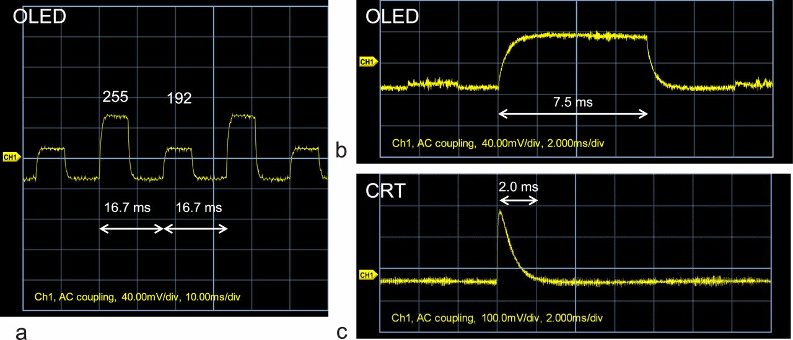
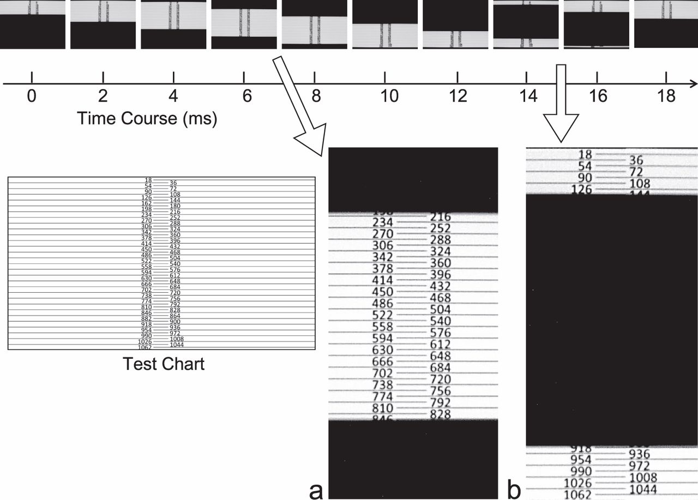

#Temporal characteristics
For the OLED display tested here, the rise and fall in luminance intensity was rapid and light emission can be sustained. Figure 19 shows the time course of the light emission intensity for the PVM-2541 display. Changes in light intensity were measured using a photodiode aimed at a point on a white horizontal line with a black background. Because this monitor displays images that are refreshed at a frequency of 60 Hz, the duration of each frame is 16.7 ms. It is clear that, during a frame, both light-emitting and inserted black periods are present. Thus, sustained white signals from a computer result in a repeated 16.7-ms sequence of white followed by black (see Figure 19a). A two-frame presentation of white corresponds to a sequence of white–black–white–black. The duration of the black period seems to be constant irrespective of the white luminance level. Because of the rapid rise/fall in luminance and the black period, the luminance in one frame may not affect that in the next, which is a great advantage for OLED displays. The time course of the light intensity on the PVM-2541 display differs considerably from those of both CRT displays and modern LCDs (see Elze, 2010a). 
These results indicate that the rise time of the present OLED display is faster than that of most LCDs but slower than that of CRTs. 

The time course of an actual image displayed on the screen is illustrated in Figure 20. To assess the detailed time course of the light emission, we used the test chart shown in Figure 20. The numbers in the test chart indicate raster line numbers from 0 to 1079. The upper panel shows the time course of the test chart that actually appeared on the screen. In this figure 0 ms is an arbitrary point in time. The screen images were sampled at intervals of 2 ms with a shutter speed of 100 μs using a high-speed digital camera system (Detect, HAS-L1). The scanning of the screen image progresses from the top to the bottom, just like that on a CRT. One critical difference between the two types of display is that the image remains for a while on the OLED display, as shown in Figure 20. Thus, displayed image and black areas translate vertically in the form of a band. The proportion of each indicates the relative times of light emission and black. As shown in Figure 20a and b, the ratio of the displayed area to the black is approximately 0.45:0.55. This suggests that within a frame of 16.7 ms the duration of light emission is 7.5 ms, and that of the black period is 9.2 ms. These values correspond well with the time course of light intensity shown in Figure 19. 

#Movie presentation
Figure 21. Movie presentation including one-frame stimuli. The left panel shows the programmed frame sequence. Each frame
duration was 16.7 ms. The right panel shows the images actually displayed on an LCD (Mitsubishi, RDT233WX-3D) and the OLED
display placed side-by-side. Photographs were taken every 6 ms. The shutter speed was 1 ms. The left (right) side in each picture
shows the image on the LCD (OLED display). The LCD was set in Game mode with the ‘‘Overdrive mode 1’’ on. Each programmed
frame was clearly defined on the OLED display, whereas the vertical and horizontal stripes were not separated on the LCD screen.
Note that the image appearing on the LCD screen is delayed by two to three frames relative to that on the OLED display

[ref](http://jov.arvojournals.org/article.aspx?articleid=2121657)

#响应时间跟像素色彩关系比较大
a change from black to dark brown may take 5ms but a larger change in color from black to white may take 20ms.