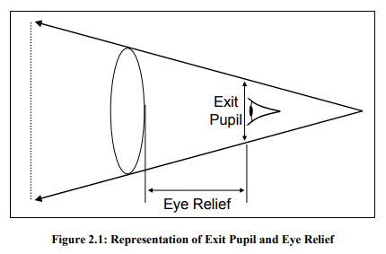

# Fresnel lens
One unfortunate side effect of Fresnel lenses is that **glaring** can be frequently observed as light scatters across the ridges along the surface.
There are two problems with Fresnel lenses. 
* The main problem is what happens when light hits the ridges, those peaks in the lens that do not correspond to actual curvature in the original lens. When light hits these points it is scatted, and scattered light in an optical system reduces contrast. Thus, you will often see that a Fresnel lens produces a more “milky” image with lower contrast. 
* The second problem is a more technical one – it is more difficult to simulate a Fresnel lens in an optical design software.
*  If **weight** is key, Fresnel may be a great option. If performance is most important, Fresnel lenses might not be the first choice.

[see detail](http://sensics.com/the-promise-and-perils-of-using-fresnel-lenses-2/)

# eye relief & exit pupil
如果考虑眼镜，Eye relief一般不小于25mm，如果不考虑，则可以做的更小。
大的eye relief对应小的exit pupil(or eye box)，两者反相关。

As the position of the pupil over the lens changes laterally, the distortion varies and becomes asymmetric.
This motivates **making the lens as large as possible** so that this problem is reduced.

# lens formula

